# 网规笔记

## 软考类目

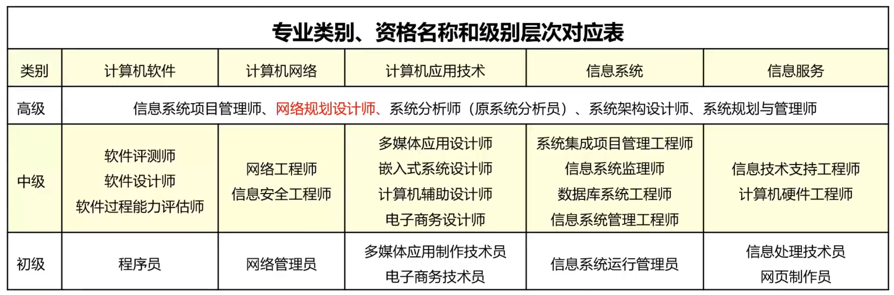

## 网规成绩占比

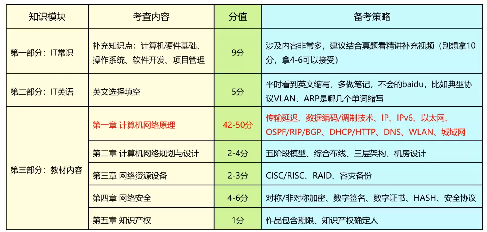

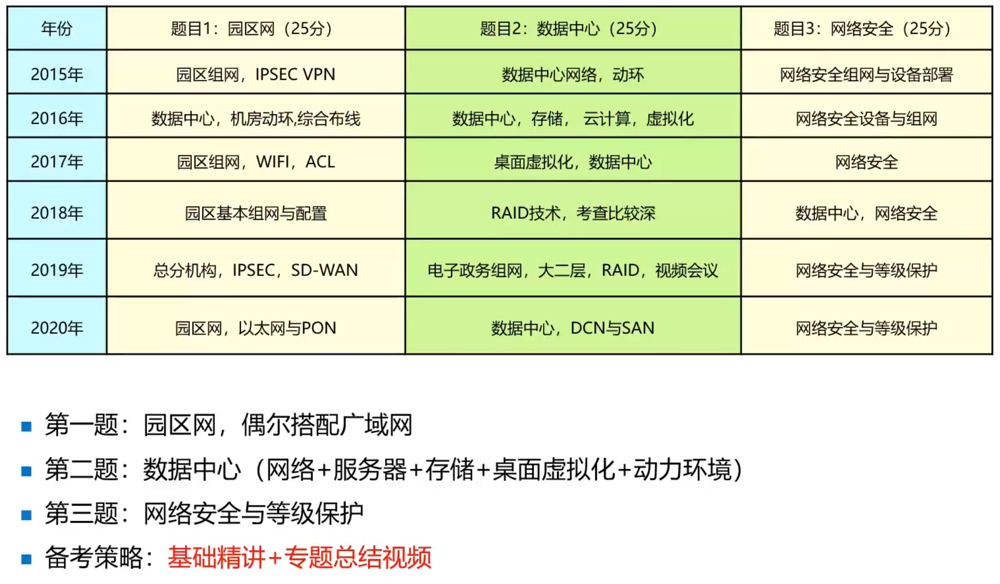

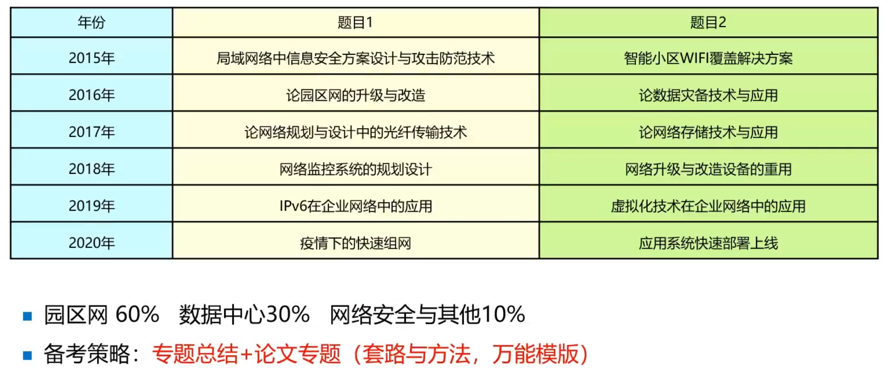

# 1 计算机网络基础概念

1. 计算机网络是一个将分散的、具有独立功能的计算机系统，通过**通信设备**与**线路**连接起来的，由功能完善的软件**实现资源共享**的系统

2. 三网融合：**电信网络**、**电视网络**、**计算机网络**

## 1.1 计算机网络组成

3. 计算机网络**物理**组成：计算机网络包括**硬件**、**软件**、**协议**三部分

4. 计算机网络**功能**组成：
   **通信网络**：**通信节点**（交换机、路由器）、**通信连路**（电话线、微波、光纤）  【用于传输】
   **用户资源子网**：**PC**、**服务器**等                                                                                  【用于处理】
   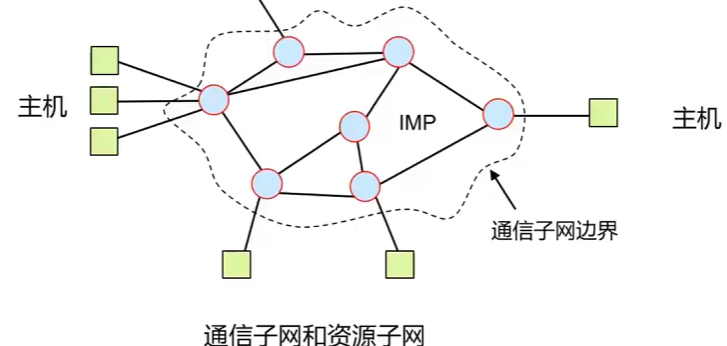

## 1.2 计算机网络分类

### 1.2.1 拓扑结构

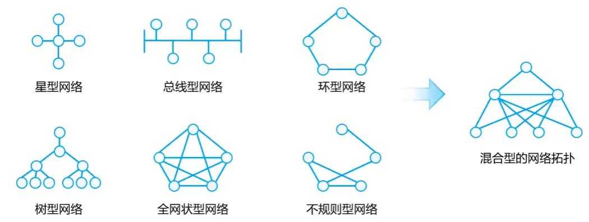

### 1.2.2 LAN MAN WAN

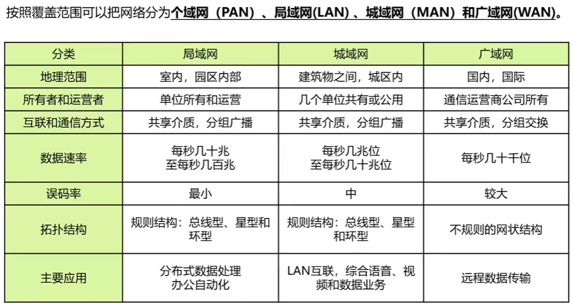

### 1.2.3 其他分类方式

**电路交换**：比如传统电话机连线，独占电路资源，多一个都不行

**报文交换**：一跳一跳的传送，每一跳都完整的传输

**分组交换**：一跳一跳的传送，但是拆分着传输。
虚电路（X.25、FR、ATM）：先建立虚电路，后续保持一致
数据报（IP）：不建立虚电路，数据到底目的可走多条线

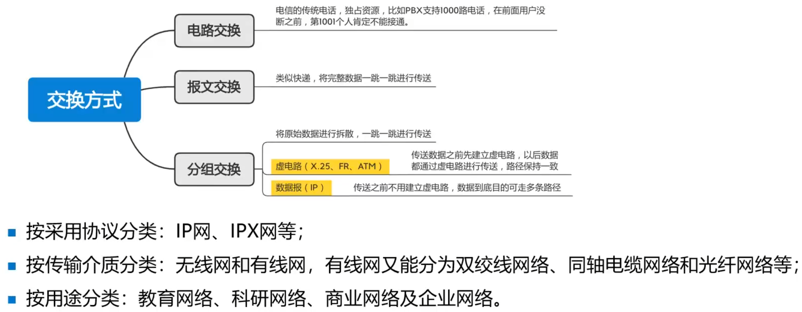

## 1.3 OSI模型

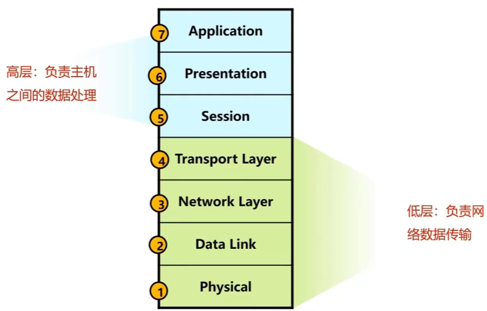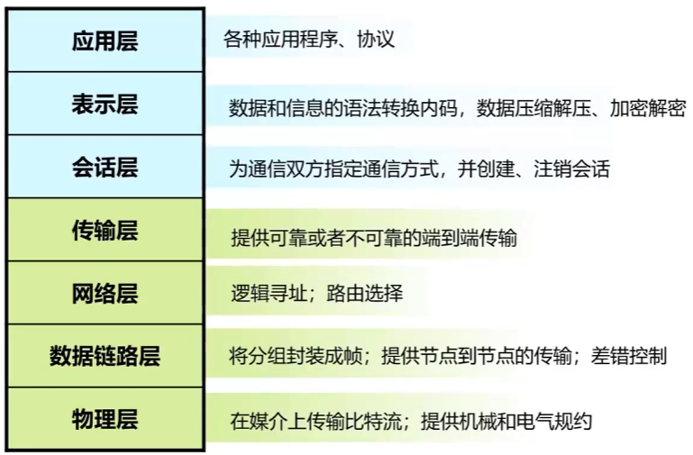

**应用层**：
为应用软件提供接口
常见的应用层协议
常见端口：http(80)、ftp(20/21)、smtp(25)、pop3(110)、telnet(23)、dns(53)等

**表示层**：
数据的编码和解码、数据的加密和解密、ASCII、JPEG

**会话层**：
负责会话连接、会话控制、协调通信

**传输层**：
负责将上层应用程序的数据进行分段和重组，**端到端**数据传输，传输层协议：**TCP**、**UDP**

**☆ 网络层**：
定义了逻辑地址（三层地址）、分组寻址、路由选择/维护，网络层协议：**ARP**协议、**DNS**

**数据链路层**：
在不可靠的物理链路上，提供可靠的数据传输服务
流量控制、差错控制
局域网链路层协议：**以太网**、令牌环、FDDI、Apple Talk
广域网链路层协议：X.25、FR、**PPP**、**HDLC**

**物理层**：
提供机械和电气规约（线缆）

七层分别功能类比：

- **应用层**：（CEO）要干什么？（发邮件/看视频）
- **表示层**：（秘书）把话说成对方听得懂的语言（加密/翻译）
- **会话层**：（接线员）咱俩约好啥时候聊，断了咋续（建连/重连）
- **传输层**：（调度中心）把大文件切碎，塞上端口号，要快还是要稳？（TCP/UDP，端口号）
- **网络层**：（地图导航）导航规划从中国到美国的宏观路线（IP地址，路由）
- **数据链路层**：（快递员）负责把车从高速A口安全送到B口，看车牌（MAC地址，差错校验）
- **物理层**：（路）就是那条柏油马路和车轮子的物理滚动（网线/光纤/电压）

物理层接头类型：

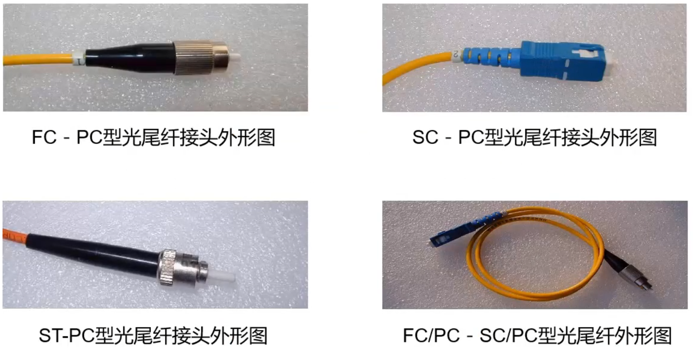

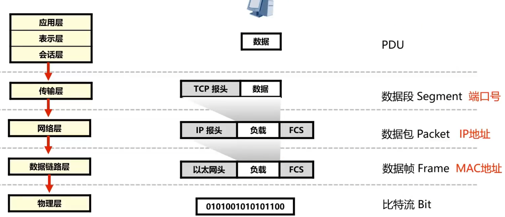

## 1.4 TCP/IP协议簇

### 1.4.1 基本概念

传输控制协议/因特网协议（TCP/IP）**Transmission Control Protocol / Internet Protocol**

TCP/IP是由一组不同功能的协议组合在一起构成的协议簇

- **IP**（网际协议）：负责把数据包送到目的地（**寻址**，就是公/私IP地址）
- **TCP**（传输控制协议）：负责把数据可靠地、按顺序送到对方手里（**打电话**，确保对方收到，收不到就重发）
- **UDP**（用户数据报协议）：也是传输数据，但不管对方收没收到（**寄明信片**，速度快但不管丢没丢）。
- **HTTP/HTTPS**（超文本传输协议）：看网页用的就是这个
- **FTP**（文件传输协议）：用来传大文件

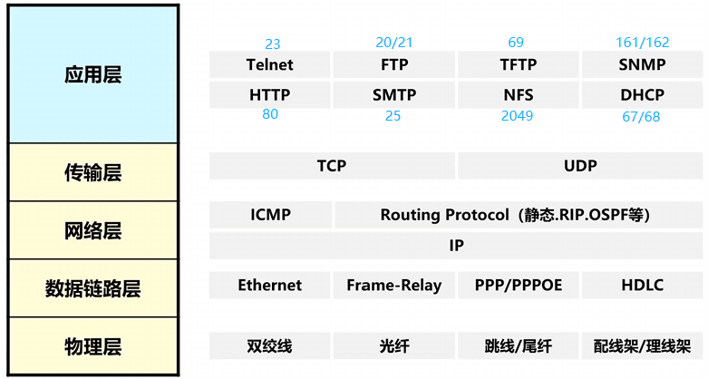

### 1.4.2 应用层协议对应的端口号

具体见下一章第一节

### 1.4.3 传输层（TCP / UDP）本身

**它们没有固定的端口号。**

TCP和UDP是**搬运工**，它们报文的**头部**里预留了“源端口”和“目的端口”这两个空位（各占16位），用来填写上面应用层的那些数字（比如80、443）。所以端口号是写在TCP/UDP的“快递面单”上的，而不是TCP/UDP自己的名字。

### 1.4.4 网络层（IP / ICMP / 路由协议）用什么代替端口号

这一层**绝对没有端口号**，它们用的是 **“协议号”**（一个数字，用来告诉电脑上层是啥）：

- **IP协议**：本身是“快递货车”，没有端口。
- **ICMP**（比如你常用的`ping`命令）：**没有端口**！它靠的是 **“类型（Type）”和“代码（Code）”** 来区分功能（比如`Type 8`是请求，`Type 0`是回复）。
- **路由协议**（RIP / OSPF）：
  - **RIP**：虽然它基于**UDP 520端口**（这是特例，它借用应用层端口工作）。
  - **OSPF**：没有端口！它直接封装在IP协议里，靠 **IP协议号 89** 来识别。
  - **静态路由**：这只是一个配置命令，根本不产生网络流量，连协议号都没有。

### 1.4.5  数据链路层 & 物理层

- **数据链路层**（Ethernet/PPP等）：靠的是 **MAC地址**（你之前问过的身份证号）和 **类型字段**（比如0x0800表示上层是IP）。
- **物理层**（双绞线/光纤等）：全是**硬件接口和线缆**，只关心电压、光信号、插头（RJ45水晶头、LC光纤头），连地址都没有，更别说端口号了。

**口诀**： 
IP看协议号（如OSPF是89），应用看端口号（如HTTP是80），链路看MAC，物理看线头。

**ARP**在OSI的七层协议里算网络层，在TCP/IP属于数据链路层。

## 1.5 协议端口号/特殊IP和MAC

### 1.5.1 协议端口号

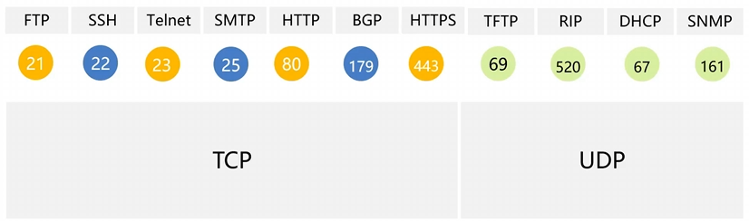

| 协议缩写               | 英文全称                                               | 端口号                                  | 传输层协议 | 一句话用途（场景）                                           |
| :--------------------- | :----------------------------------------------------- | :-------------------------------------- | :--------- | :----------------------------------------------------------- |
| **FTP**(传文件)        | **F**ile **T**ransfer **P**rotocol                     | **20**（数据）、**21**（控制）          | TCP        | 传输文件（上传/下载大文件）                                  |
| **SSH**(加密登)        | **S**ecure **Sh**ell                                   | **22**                                  | TCP        | 加密远程登录服务器（运维最爱）                               |
| **Telnet**(非密老古董) | **Tel**etype **Net**work                               | **23**                                  | TCP        | 老式非加密远程登录（现在极少用）                             |
| **SMTP**(发邮件)       | **S**imple **M**ail **T**ransfer **P**rotocol          | **25**                                  | TCP        | 发邮件（把你的信从客户端送到邮件服务器）                     |
| **HTTP**(没锁)         | **H**yper**T**ext **T**ransfer **P**rotocol            | **80**                                  | TCP        | 普通网页访问（没锁头图标的那种）                             |
| **BGP** ⚠️(外交)        | **B**order **G**ateway **P**rotocol                    | **179**                                 | TCP        | **互联网核心路由**（各大运营商之间交换路由表）               |
| **HTTPS**(有锁)        | **H**yper**T**ext **T**ransfer **P**rotocol **S**ecure | **443**                                 | TCP        | 加密网页访问（有锁头图标的银行/支付页面）                    |
| **TFTP**(极简传)       | **T**rivial **F**ile **T**ransfer **P**rotocol         | **69**                                  | **UDP**    | 简单文件传输（常用于路由器交换机传固件，不校验）             |
| **RIP** ⚠️(外交)        | **R**outing **I**nformation **P**rotocol               | **520**                                 | **UDP**    | **小型网络内部路由**（小公司路由器之间自动学习路径）         |
| **DHCP**(自动分房)     | **D**ynamic **H**ost **C**onfiguration **P**rotocol    | **67**（服务器） **68**（客户端）       | **UDP**    | **自动分配IP**（就是你电脑连WiFi拿到`192.168.x.x`的那个协议） |
| **SNMP**(看设备状态)   | **S**imple **N**etwork **M**anagement **P**rotocol     | **161**（代理查询） **162**（陷阱告警） | **UDP**    | 监控网络设备（路由器/交换机的CPU、温度、流量）               |

| **RIP** 和 **BGP** 虽然干的是“网络层路由”的活儿（帮数据包找路），但**它们本身的实现机制，是依靠应用层把路由信息打包，再通过传输层（TCP/UDP）发送给邻居路由器的**。

### 1.5.2 特殊IP地址

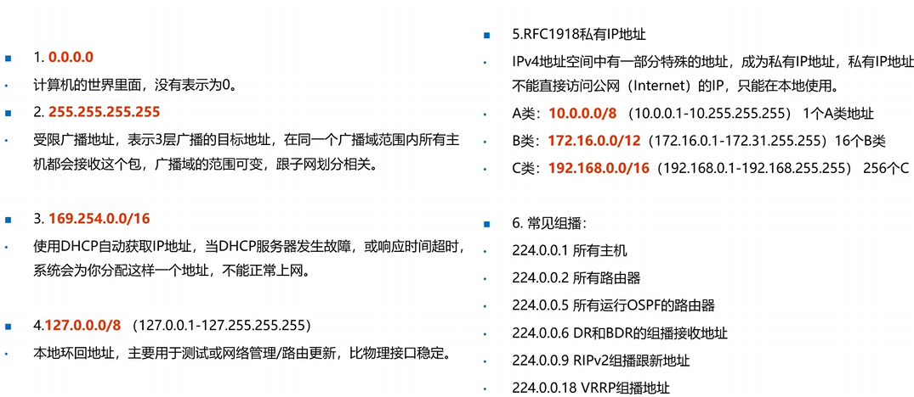

判断一个IP是A、B、C哪一类，**不用看子网掩码**，只需要看**第一个数字（第一个字节）的二进制前几位**：

| 类别        | 二进制开头特征         | 对应的第一个数字范围 | 设计逻辑（自动划分网络/主机）                         |
| :---------- | :--------------------- | :------------------- | :---------------------------------------------------- |
| **A类**     | 首位必须是 **`0`**     | **0 ~ 127**          | 网络位占8位，主机位占24位（适合超大型网络）           |
| **B类**     | 前两位必须是 **`10`**  | **128 ~ 191**        | 网络位占16位，主机位占16位（适合中型网络）            |
| **C类**     | 前三位必须是 **`110`** | **192 ~ 223**        | 网络位占24位，主机位占8位（适合小型网络，你家最常用） |
| D类（组播） | 前四位是 `1110`        | 224 ~ 239            | 不分配给主机，用于组播                                |
| E类（保留） | 前四位是 `1111`        | 240 ~ 255            | 科研实验用                                            |

### 1.5.3 特殊MAC地址

## 3 基础网络协议

## 3.1 IP地址基础

在IP网络中，通信节点需要有一个唯一的IP地址;

IP地址用于IP报文的寻址以及标识一个节点;

IPv4地址一共32bits，使用点分十进制的形式表示;

IPv6地址一共128位，用冒号分割的16进制表示。
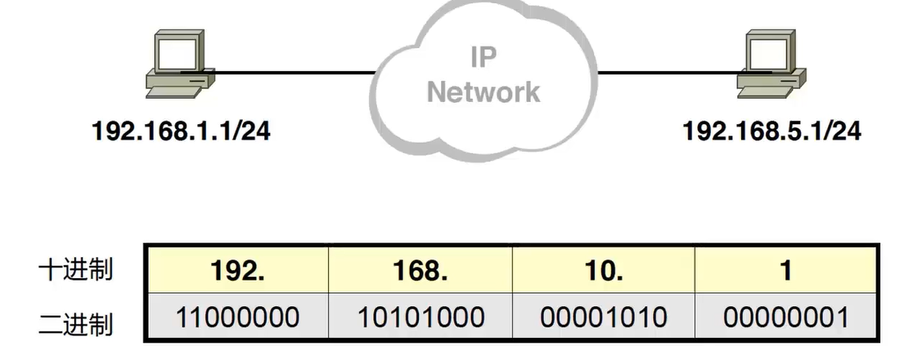

### 3.1.1 IP地址类型

子网内的**地址角色**（微观/实际使用）:

网络地址:指代网络的地址。在网络的IPv4地址范围内，最小地址保留为网络地址。此地址的主机部分的每个主机位均为0（即 `192.168.1.0`）。代表这个网络本身，不能分配给具体设备。

广播地址:用于向网络中的所有主机发送数据的特殊地址。广播地址使用该网络范围内的最大地址。即主机部分的各比特位全部为1的地址（即 `192.168.1.255`）。用于向该网络内的所有设备发送数据，不能分配给具体设备。

主机地址:可分配给网络中终端设备的地址（即 `192.168.1.1` 到 `192.168.1.254`）。

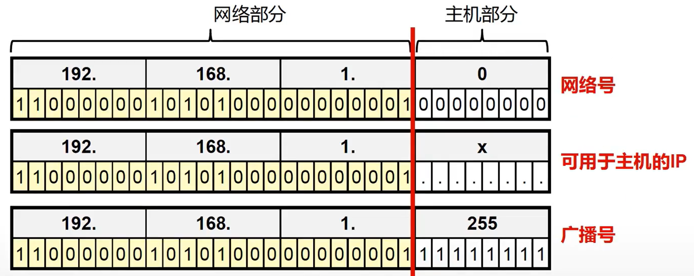

IP地址的**地址类别**（宏观/早期定义）：

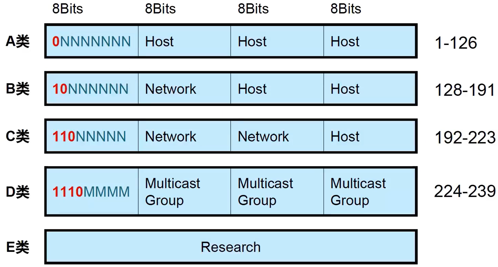

### 3.1.2 网络掩码

网络掩码与IP地址搭配使用，用于描述一个IP地址中的网络部分及主机部分。

网络掩码32bits，与32bits的IP地址一一对应，掩码中为1的位对应IP地址中的网络位，掩码中为0的位对应IP地址中的主机位。

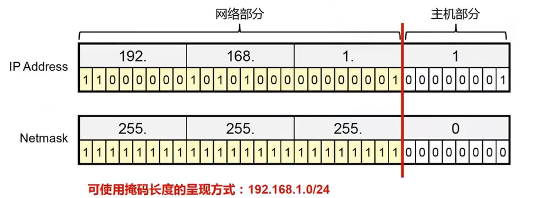

### 3.1.3 IP网络通信类型

- 单播Unicast
- 广播 Broadcast
- 组播Multicast

## 3.2 子网划分VLSM

为什么要划分？：一个B类地址用于一个广播域，地址浪费。广播域太庞大，一旦发生广播，内网不堪重负。

如何解决？：将一个网络号划分成多个子网，每个子网分配给一个独立的广播域，如此一来广播域的规模更小、网络规划更加合理，IP地址得到了合理利用。

如何具体划分？：网络位向主机借位，形成子网
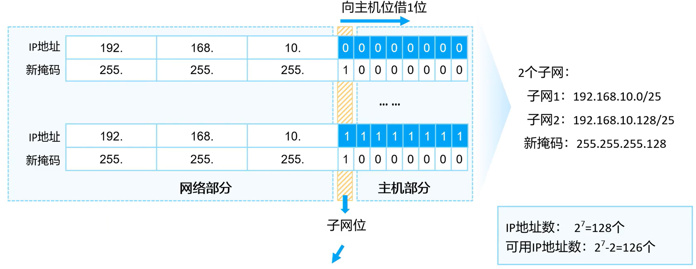

可变长子网掩码，VLSM(Variable Length Subnet Mask)

$2^m$  =   向主机位借位后产生的子网个数，m为所借的位数

$2^n-2$   =   向主机位借位后产生的每个子网中可用主机IP数，n为原主机位剔除被借位后的剩余位数，-2的原因是，每个子网中的网络号及广播号不可用

网络划分：

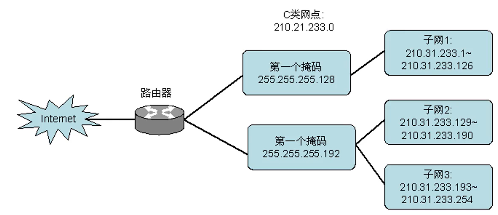

## 3.3 无类域间路由CIDR

CIDR（无类域间路由，超网 Classless Inter-Domain Routing）

1. 减少骨干路由器表项压力
2. 缓解IP地址耗尽

工作原理如下:（路由聚合)

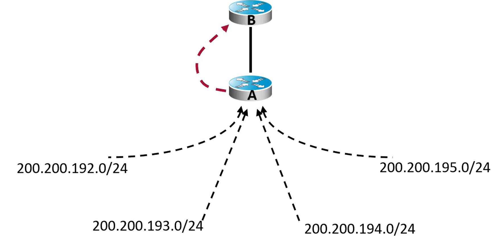

RouterB路由表可以是200.200.192.0/22，而不是象RouterA那样显示4条路由。

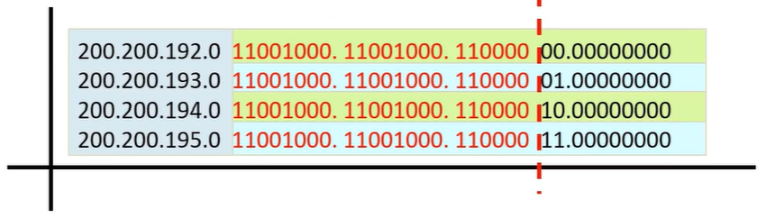

例题

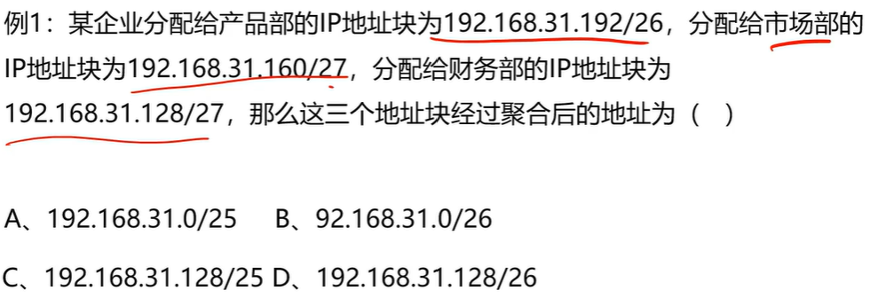

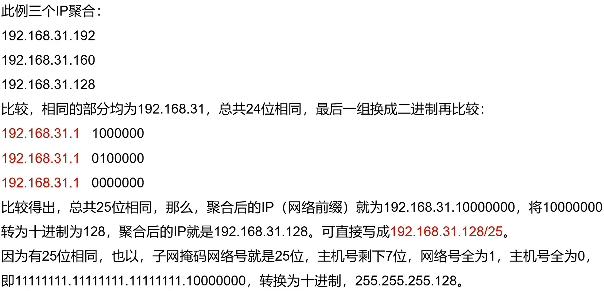

## 3.4 IPv6与过渡技术

IPv6地址扩展到128位

采用冒号分隔的十六进制数表示

例：8000:0000:0000:0000:0123:4567:89AB:CDEF

- 每个字段前面的0可以省去，例如0123可以简写为123

- 一个或多个全0字段，可以用一对冒号"::”代替

- 以上地址可简写为 8000::123:4567:89AB:CDEF

- IPv4兼容地址可以写为::192.168.10.1

- 有效0位不可以简写，双冒号只能出现一次

合法写法：
12AB:0000:0000:CD30.0000:0000:0000:0000/60
12AB::CD30:0:0:0:0/60
12AB:0:0:CD30::/60

非法写法：
12AB:0:0:CD3/60(在16位的字段中可以省掉前面的0，但不能省掉后面的0)
12AB::CD30/60(这种表示可展开为12AB:0000:0000:0000:0000:0000:0000:CD30)
12AB::CD3/60(这种表示可展开为12AB:0000:0000:0000:0000:0000:0000:0CD3)

节点地址与其子网前缀组合起来可采用紧缩形式表示，例如节点地址:
12AB:0:0:CD30: 123:4567:89AB:CDEF

若其子网号为2AB:0:0:CD30::/60,则等价的写法是
12AB:0:0:CD30: 123:4567:89AB:CDEF/60

**IPv6地址分类**：

**单播地址**
	不确定地址:地址0:0:0:0:0:0:0:0称为不确定地址，不能分配给任何节点
	回环地址:地址0:0:0:0:0:0:0:1称为回环地址
	可聚合全球单播地址：这种地址在全球范围内有效，相当千IPv4公用地址(前缀为001)
	站点本地地址:相当干IPv4中的私网地址(前缀为1111111011)
	链路本地地址:用于同一链路的相邻节点间的通信(前缀为1111111010) 结合MAC地址自动	生成
	【助记:1聚2恋3占】

**任意播地址** 表示一组接口的标识符，通常是路由距离最近的接口
	任意播地址不能用作源地址，而只能作为目标地址
	任意播地址不能指定给IPv6主机，只能指定给IPv6路由器

**组播地址**
	发往组播地址的分组被传送给该地址标识的所有接口
	IPv6中没有广播地址，它的功能已被组播地址所代替
	IPv6组播地址的格式前缀为1111 1111

**IPv4和IPv6地址对比**：

 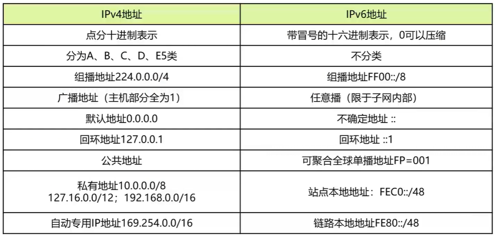

**IPv4到IPv6过渡技术**：

**隧道技术**：解决IPv6节点之间通过IPv4网络进行通信
**双栈技术**：同时运行IPv4和IPv6 
**翻译技术**：解决纯IPv6节点与纯IPv4节点之间通进行通信

## 3.5 IP报文格式

IPv4报文格式：

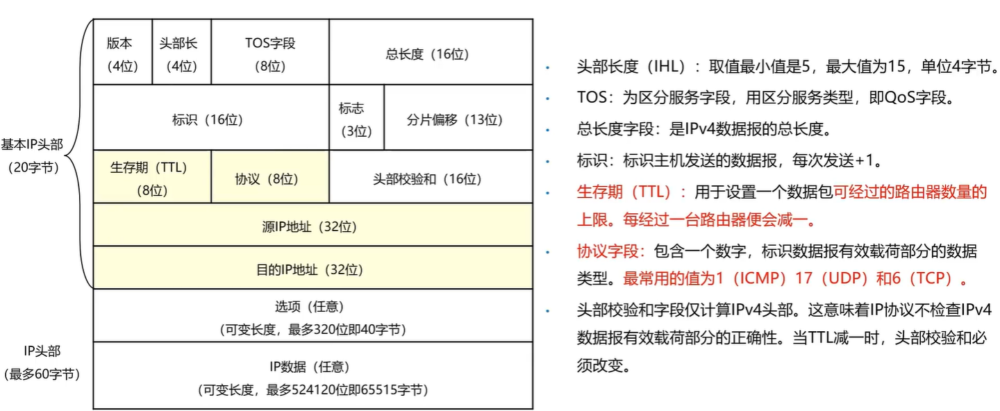

> TTL和协议号考得多
>
> 除了最后一个分片，**每个分片的数据部分必须是8字节的整数倍**（因为偏移量以8为单位）。
>
> 标准头部长度 = **20字节**（IHL=5）

IPv6报文格式：

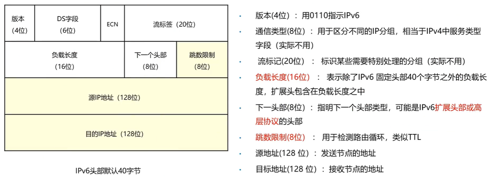

以太网报文封装：

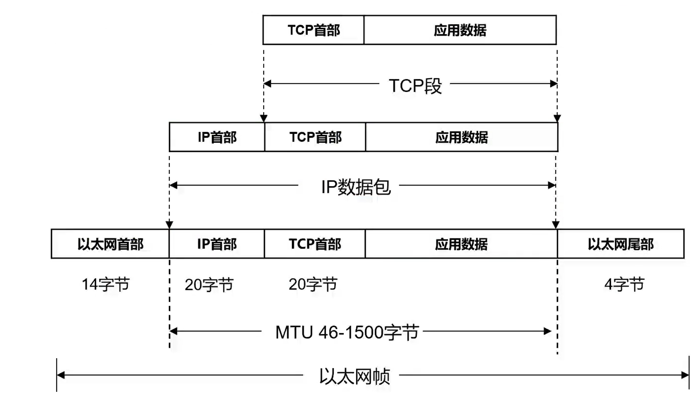

> 默认**以太网MTU=1500字节**
> **MTU** 是 **Maximum Transmission Unit**（最大传输单元）的缩写

例题：

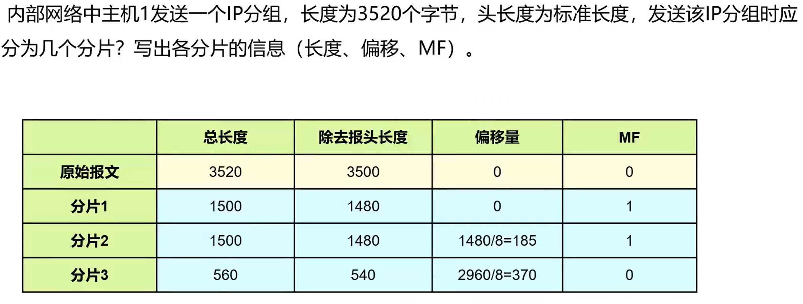

> 片偏移 = 前面所有分片数据总长 ÷ 8
>
> 总长去头算数据， MTU 减头定每片。
> 除八取整算偏移， 前片累加做分子。
> 非末 MF 等于 1， 最后一片 MF 0。

## 3.6 ICMP

Internet控制消息协议ICMP(Internet Control Message Protocol)是IP协议的辅助协议。

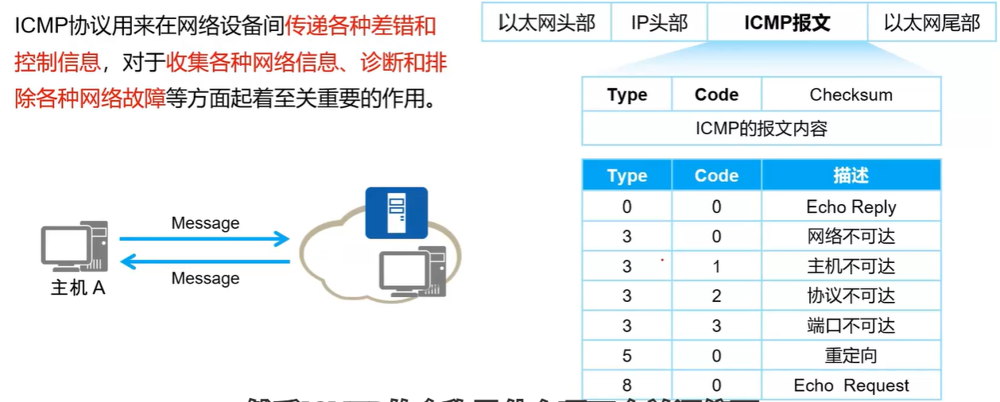

3.7 ARPRARP

3.8 TCP和UDP

3.9 数据封装转发全过程

