# 网规笔记

## 软考类目

## 网规成绩占比

# 1 计算机网络基础概念

1. 计算机网络是一个将分散的、具有独立功能的计算机系统，通过**通信设备**与**线路**连接起来的，由功能完善的软件**实现资源共享**的系统

2. 三网融合：**电信网络**、**电视网络**、**计算机网络**

## 1.1 计算机网络组成

3. 计算机网络**物理**组成：计算机网络包括**硬件**、**软件**、**协议**三部分

4. 计算机网络**功能**组成：
   **通信网络**：**通信节点**（交换机、路由器）、**通信连路**（电话线、微波、光纤）  【用于传输】
   **用户资源子网**：**PC**、**服务器**等                                                                                  【用于处理】
   

## 1.2 计算机网络分类

### 1.2.1 拓扑结构

### 1.2.2 LAN MAN WAN

### 1.2.3 其他分类方式

**电路交换**：比如传统电话机连线，独占电路资源，多一个都不行

**报文交换**：一跳一跳的传送，每一跳都完整的传输

**分组交换**：一跳一跳的传送，但是拆分着传输。
虚电路（X.25、FR、ATM）：先建立虚电路，后续保持一致
数据报（IP）：不建立虚电路，数据到底目的可走多条线

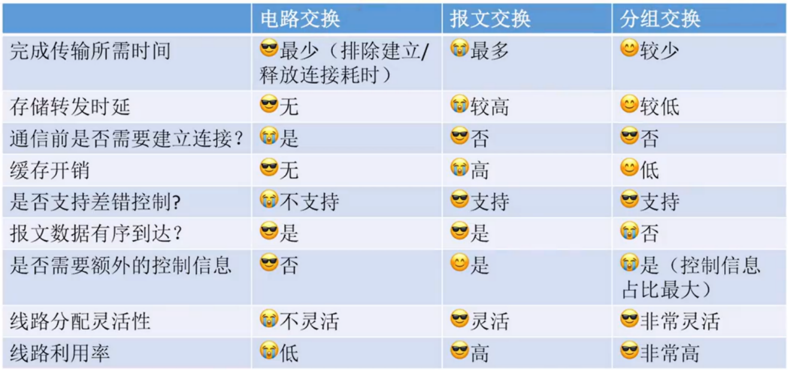

## 1.3 OSI模型

**应用层**：
为应用软件提供接口
常见的应用层协议
常见端口：http(80)、ftp(20/21)、smtp(25)、pop3(110)、telnet(23)、dns(53)等

**表示层**：
数据的编码和解码、数据的加密和解密、ASCII、JPEG

**会话层**：
负责会话连接、会话控制、协调通信

**传输层**：
负责将上层应用程序的数据进行分段和重组，**端到端**数据传输，传输层协议：**TCP**、**UDP**

**☆ 网络层**：
定义了逻辑地址（三层地址）、分组寻址、路由选择/维护，网络层协议：**IP**、**ICMP**、**ARP**协议

**数据链路层**：
数据链路层提供成帧、MAC 寻址、差错检测和介质访问等功能；是否重传、是否可靠取决于具体协议，不能笼统说数据链路层必然可靠。
流量控制、差错控制
局域网链路层协议：**以太网**、令牌环、FDDI、Apple Talk
广域网链路层协议：X.25、FR、**PPP**、**HDLC**

**物理层**：
提供机械和电气规约（线缆）

七层分别功能类比：

- **应用层**：（CEO）要干什么？（发邮件/看视频）
- **表示层**：（秘书）把话说成对方听得懂的语言（加密/翻译）
- **会话层**：（接线员）咱俩约好啥时候聊，断了咋续（建连/重连）
- **传输层**：（调度中心）把大文件切碎，塞上端口号，要快还是要稳？（TCP/UDP，端口号）
- **网络层**：（地图导航）导航规划从中国到美国的宏观路线（IP地址，路由）
- **数据链路层**：（快递员）负责把车从高速A口安全送到B口，看车牌（MAC地址，差错校验）
- **物理层**：（路）就是那条柏油马路和车轮子的物理滚动（网线/光纤/电压）

物理层接头类型：

## 1.4 TCP/IP协议簇

### 1.4.1 基本概念

传输控制协议/因特网协议（TCP/IP）**Transmission Control Protocol / Internet Protocol**

TCP/IP是由一组不同功能的协议组合在一起构成的协议簇

- **IP**（网际协议）：负责把数据包送到目的地（**寻址**，就是公/私IP地址）
- **TCP**（传输控制协议）：负责把数据可靠地、按顺序送到对方手里（**打电话**，确保对方收到，收不到就重发）
- **UDP**（用户数据报协议）：也是传输数据，但不管对方收没收到（**寄明信片**，速度快但不管丢没丢）。
- **HTTP/HTTPS**（超文本传输协议）：看网页用的就是这个
- **FTP**（文件传输协议）：用来传大文件

### 1.4.2 应用层协议对应的端口号

具体见下一章第一节

### 1.4.3 传输层（TCP / UDP）本身

**它们没有固定的端口号。**

TCP和UDP是**搬运工**，它们报文的**头部**里预留了“源端口”和“目的端口”这两个空位（各占16位），用来填写上面应用层的那些数字（比如80、443）。所以端口号是写在TCP/UDP的“快递面单”上的，而不是TCP/UDP自己的名字。

### 1.4.4 网络层（IP / ICMP / 路由协议）用什么代替端口号

这一层**绝对没有端口号**，它们用的是 **“协议号”**（一个数字，用来告诉电脑上层是啥）：

- **IP协议**：本身是“快递货车”，没有端口。
- **ICMP**（比如你常用的`ping`命令）：**没有端口**！它靠的是 **“类型（Type）”和“代码（Code）”** 来区分功能（比如`Type 8`是请求，`Type 0`是回复）。
- **路由协议**（RIP / OSPF）：
  - **RIP**：虽然它基于**UDP 520端口**（这是特例，它借用应用层端口工作）。
  - **OSPF**：没有端口！它直接封装在IP协议里，靠 **IP协议号 89** 来识别。
  - **静态路由**：这只是一个配置命令，根本不产生网络流量，连协议号都没有。

### 1.4.5  数据链路层 & 物理层

- **数据链路层**（Ethernet/PPP等）：靠的是 **MAC地址**（你之前问过的身份证号）和 **类型字段**（比如0x0800表示上层是IP）。
- **物理层**（双绞线/光纤等）：全是**硬件接口和线缆**，只关心电压、光信号、插头（RJ45水晶头、LC光纤头），连地址都没有，更别说端口号了。

**口诀**： 
IP看协议号（如OSPF是89），应用看端口号（如HTTP是80），链路看MAC，物理看线头。

**ARP**在OSI的七层协议里算网络层，在TCP/IP属于数据链路层。

## 1.5 协议端口号/特殊IP和MAC

### 1.5.1 协议端口号

[^1.5.1]: here

| 协议缩写               | 英文全称                                               | 端口号                                  | 传输层协议 | 一句话用途（场景）                                           |
| :--------------------- | :----------------------------------------------------- | :-------------------------------------- | :--------- | :----------------------------------------------------------- |
| **FTP**(传文件)        | **F**ile **T**ransfer **P**rotocol                     | **20**（数据）、**21**（控制）          | TCP        | 传输文件（上传/下载大文件）                                  |
| **SSH**(加密登)        | **S**ecure **Sh**ell                                   | **22**                                  | TCP        | 加密远程登录服务器（运维最爱）                               |
| **Telnet**(非密老古董) | **Tel**etype **Net**work                               | **23**                                  | TCP        | 老式非加密远程登录（现在极少用）                             |
| **SMTP**(发邮件)       | **S**imple **M**ail **T**ransfer **P**rotocol          | **25**                                  | TCP        | 发邮件（把你的信从客户端送到邮件服务器）                     |
| **HTTP**(没锁)         | **H**yper**T**ext **T**ransfer **P**rotocol            | **80**                                  | TCP        | 普通网页访问（没锁头图标的那种）                             |
| **BGP** ⚠️(外交)        | **B**order **G**ateway **P**rotocol                    | **179**                                 | TCP        | **互联网核心路由**（各大运营商之间交换路由表）               |
| **HTTPS**(有锁)        | **H**yper**T**ext **T**ransfer **P**rotocol **S**ecure | **443**                                 | TCP        | 加密网页访问（有锁头图标的银行/支付页面）                    |
| **TFTP**(极简传)       | **T**rivial **F**ile **T**ransfer **P**rotocol         | **69**                                  | **UDP**    | 简单文件传输（常用于路由器交换机传固件，功能简单、无登录认证） |
| **RIP** ⚠️(外交)        | **R**outing **I**nformation **P**rotocol               | **520**                                 | **UDP**    | **小型网络内部路由**（小公司路由器之间自动学习路径）         |
| **DHCP**(自动分房)     | **D**ynamic **H**ost **C**onfiguration **P**rotocol    | **67**（服务器） **68**（客户端）       | **UDP**    | **自动分配IP**（就是你电脑连WiFi拿到`192.168.x.x`的那个协议） |
| **SNMP**(看设备状态)   | **S**imple **N**etwork **M**anagement **P**rotocol     | **161**（代理查询） **162**（陷阱告警） | **UDP**    | 监控网络设备（路由器/交换机的CPU、温度、流量）               |

> **RIP** 和 **BGP** 虽然干的是“网络层路由”的活儿（帮数据包找路），但**它们本身的实现机制，是依靠应用层把路由信息打包，再通过传输层（TCP/UDP）发送给邻居路由器的**。

### 1.5.2 特殊IP地址 ☆

判断一个IP是A、B、C哪一类，**不用看子网掩码**，只需要看**第一个数字（第一个字节）的二进制前几位**：

| 类别        | 二进制开头特征         | 对应的第一个数字范围 | 设计逻辑（自动划分网络/主机）                         |
| :---------- | :--------------------- | :------------------- | :---------------------------------------------------- |
| **A类**     | 首位必须是 **`0`**     | **0 ~ 127**          | 网络位占8位，主机位占24位（适合超大型网络）           |
| **B类**     | 前两位必须是 **`10`**  | **128 ~ 191**        | 网络位占16位，主机位占16位（适合中型网络）            |
| **C类**     | 前三位必须是 **`110`** | **192 ~ 223**        | 网络位占24位，主机位占8位（适合小型网络，你家最常用） |
| D类（组播） | 前四位是 `1110`        | 224 ~ 239            | 不分配给主机，用于组播                                |
| E类（保留） | 前四位是 `1111`        | 240 ~ 255            | 科研实验用                                            |

### 1.5.3 特殊MAC地址

本节应补广播 MAC、组播 MAC、单播/组播位和本地/全球管理位。

# 2 数据通信基础

## 2.1 通信指标

### 2.1.1 通信基础概念

通信是将有用信息进行无失真、高效率的传输，而且传输过程减少或消除无用信息和有害信息。

**数据**是运输**信息的实体**，而**信号**则是数据的**电气或电磁的表现**。

**信道**：**单工通信**，只有一个方向的通信而没有反方向交互，无线电广播
 	  **半双工通道**，都能发生信息，但不能同时发送，对讲机
	   **全双工通信**，能同时发，交换机

码元：对数字信号的计量单位。一个码元指的是一个固定时长的数字信号波形，该时长称为码元的宽度。

传输速率：（1）码元传输速率:也叫码元速率、符号速率、波形速率等,它表示单位时间内数字通信系统所传输			      的码元个数(符号个数或脉冲个数),单位是波特(Baud)。
		    （2）数据传输速率:表示单位时间内数字通信系统传输的二进制码元个数,单位是比特/秒(bps)

### 2.1.2 **网络传输指标**：

带宽：指在一段特定的时间内网络所能传送的比特数，单位是比特每秒。

**时延**：1.**发送时延** (上车的时间)=报文长度/信道带宽
	    2.**传播时延** (路上跑的时间)=信道长度/信道传播速率
	    3.**处理时延**:数据在交换节点为存储转发而进行一些必要的处理所花费的时间，有时可以忽略。
	    4.总时延=发送时延+传播时延+处理时延+排队时间
	    5.**RTT**(Round-Trip Time,往返时延)也是一个重要的性能指标，它表示从发送方发送数据开始，到发送方收到来自接收方的确认，总共经历的时延。

时延带宽积：时延带宽积传播时延*带宽，相当于第一个比特到达接收方之前，发送方最多发送的比特数

误码率：指在一定统计时间内，数字信号在传输过程中发生错误的码元/位数与传输的总码元/总位数之比，一般网络要求误码率低于10^-6。

### 2.1.3 **传输损害**：

衰减：随着距离延伸而减弱

延迟变形：有线传输介质独有的现象

**噪声**：☆
**热噪声**：是导体中电子的热振动引起的，它出现在所有电子设备和传输介质中
**内调制杂音**：当不同频率的信号共享同一传输介质时产生
**串扰**：信号通路之间产生了不必要的耦合，这一般在邻近的双绞线之间因电耦合而产生，在极少数情况下也可能在运载多个信号的同轴电缆中产生。
**脉冲噪音**：非连续的且不可预测的。产生的原因包括各种意外的电磁干扰，如闪电，以及通信系统的
故障。脉冲噪声对模拟信号一般仅是小麻烦，但对数字信号是出错的主要原因

## 2.2 数据编码

### 2.2.1 数字通信系统

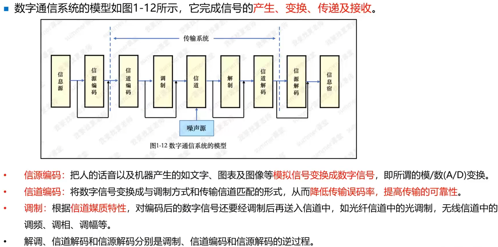

### 2.2.2 非归零码 NRZ-I ☆

**非归零编码**（Not Return to Zero，NRZ） 

规律是：当出现 “1” 时电平翻转，当 “0” 出现时电表不翻转，也叫 **差分码**  【当前数字下与前面不一样则为1】

主要用在终端到调制解调器的接口中
【100BASE-X  ：4B/5B编码 -> NRZ】
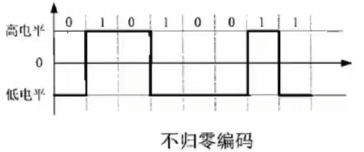

### 2.2.3 **曼彻斯特编码**

曼彻斯特编码是一种双相码，在每个比特中间均有一个跳变，**第一个编码自定义**，假设下图由高电平向低电平跳变代表 “0”，由低电平向高电平跳变代表 “1”  【1 ↑，0 ↓】

曼彻斯特编码常用于**以太网**中
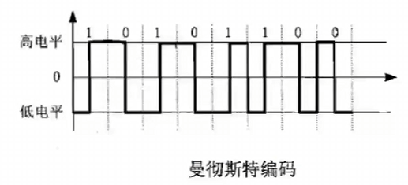

### 2.2.4 差分曼彻斯特编码

差分曼彻斯特编码也是一种双相码，用在令牌环网中

有跳变代表“0”，无跳变代表“1”           **【有0无1】**【看数字出现位置前俩个半段，平则为1】

**不是比较形状，比较始末电平**：下一个起始电平与上一个终止电平一样(没变化)表示1，有变化表示0

根据波形，从第二个电平开始推断
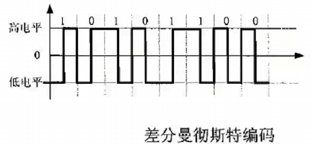

### 2.2.5 俩种曼码特点与编码效率

两种曼彻斯特编码优点:将时钟和数据包含在信号数据流中，也称**自同步码**

编码效率低：每个码元都要调制为两个不同的电平，因而调制速率是码元速率的两倍，这对信道的带宽提出了更高的要求，例如当数据传输速率为100Mbps时，需要200MHz的脉冲;

4B/5B编码：发送4bits,先使用不归零码(NRZ-I)，编码成5bit，多一位用于解决同步问题。

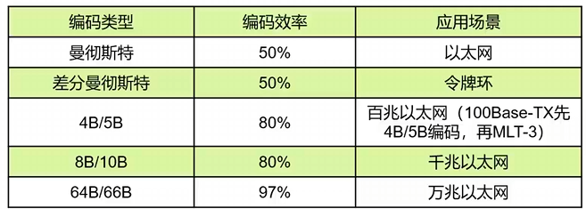

（MLT-3 ）

## 2.3 调制技术

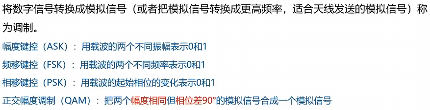

扩频通信：

## 2.4 信道延时 ☆

信道延迟：与<u>源端和宿端距离</u>有关，也与<u>信道中的信号传播速率</u>有关。

​	总延时 = 线路延迟 + 发送延迟

线路延迟 = 传输距离/传输速度    (路上跑的时间)   比如1000米电缆  延时为5μs

发送延迟 = 数据帧大小/速率  (排队上车的时间)   比如100M线路，发送1000字节数据，延时为1000 * 8/(100 * $10^6$)=8*$10^{-5}$s=80µs

- 光速为300m/μs = 300000 km/s
- 电缆中传播速度一般为光速77%，即200m/μs = 200000km/s
- 卫星信道的时延大约270ms(来回双向的延迟)

例1：
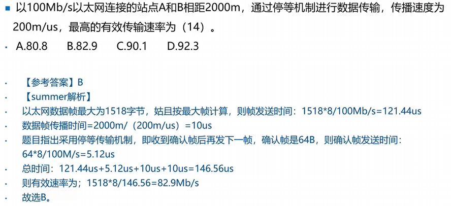

例2：
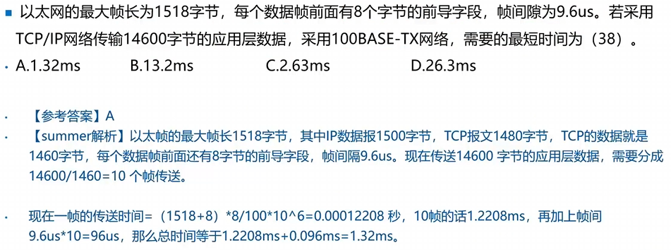

例3：
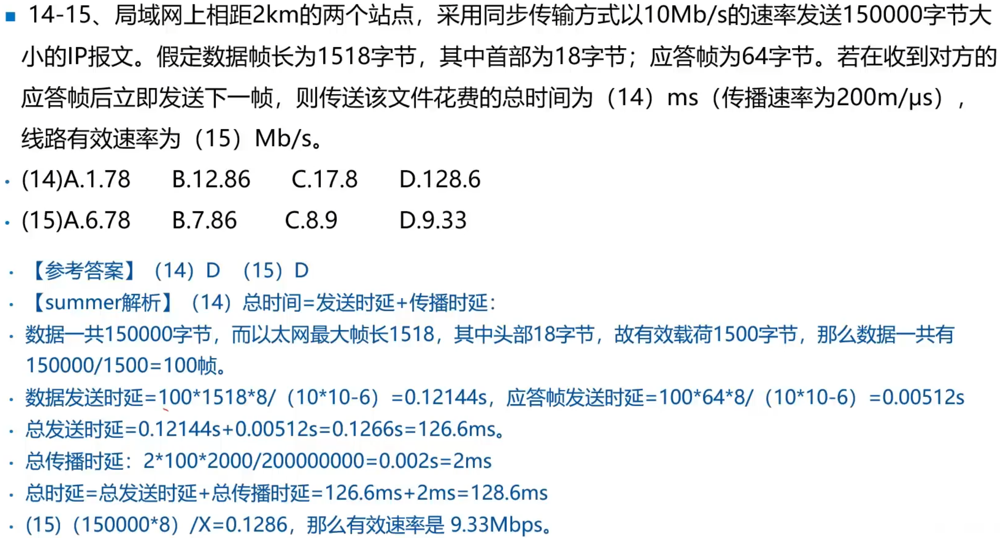

## 2.5 数据交换

1. 按通信方向分类：单工、半双工、全双工

2. 按同步方式分类：

**异步传输**：把各个字符分开传输，在**字符**之前插入一位起始位(0)，在字符之后插入一位停止位(1)，起
始位对接收方的时钟起置位作用。在字符和停止位之间还要插入一位校验位，一般使用奇偶校验。**ATM**

**同步传输**：传输**比特分组(帧)**要大得多。不是独立发送每个字符，而是把他们组合起来一起发送。我们称
这些组合为数据帧，或简称帧。数据帧的第一部分包含同步字符，用于通知接收方一个帧已经达到。帧的最后一部分是一个帧结束标记。**HDLC**
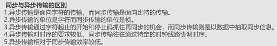

3. 按交换技术分类：电路交换（独占，物理通路）、报文交换（存储转发、一节点一跳）、分组交换（数据报、虚电路）
   数据报（ip）、虚电路（X.25、FR、ATM）

## 2.6 复用技术

多路复用技术是**把多个低速的信道组合成一个高速的信道的技术**。

光纤入户：上网、电视、电话

这种技术要用到两个设备:

- 多路复用器(Mutiplexer)，在发送端根据某种约定的规则把多个低带宽的信号符合成一个高带宽的信号;

- 多路分配器(Demultiplexer)，在接收端根据统一规则把高带宽信号分解成多个低带宽信号多路复用器和多路分

- 配器统称多路器，简写MUX

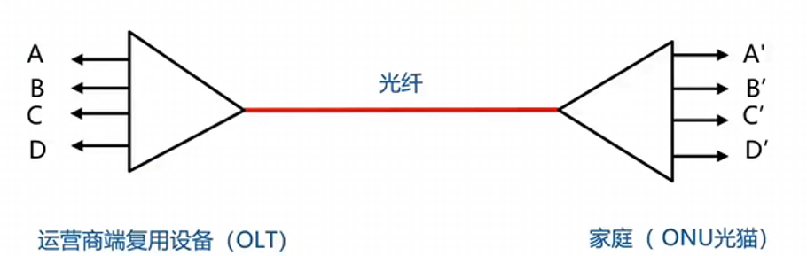

### 2.6.1 频分复用

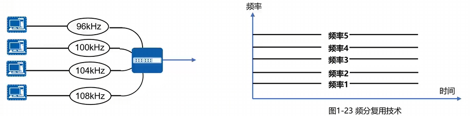

频分多路复用典型应用：无线电广播、ADSL、FDD-LTE
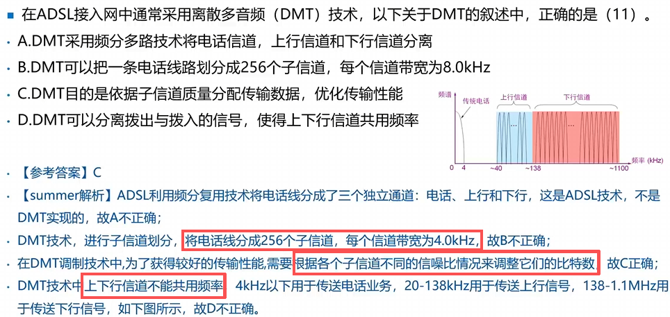

### 2.6.2 时分复用

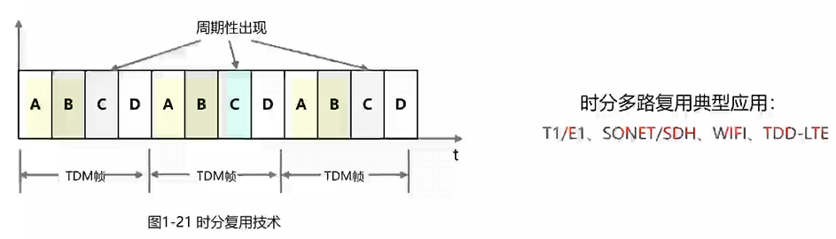

### 2.6.3 波分复用

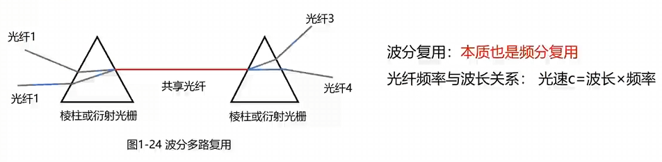

### 2.6.4 统计时分复用

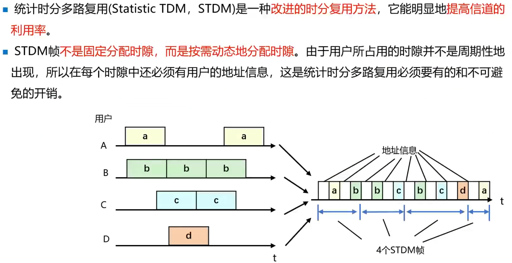

### 2.6.5 E1和T1

美国和日本使用**T1**标准，每路电话56K
T1 = 56K * 24 + 开销与间隔 = **1.544M**

欧洲采用**E1**标准，每路电话64K，传30路电话，2路开销。
E1 = 64 * 30 + 64K * 2 = **2.048M**

### 2.6.6 同步数字序列

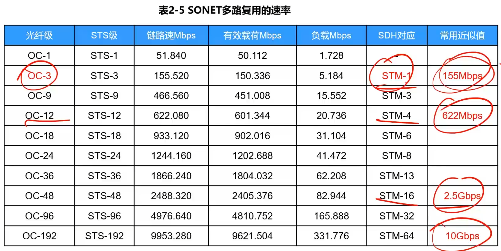

> 光纤级：OC-3、SDH对应STM-1、常用近似值155Mbps

## 2.7 差错控制、校验

### 2.7.1 差错控制概念

数据传输中出现错误不可避免，因此需要采用差错控制方法。数据通信中常用的办法是**检错**和**纠错**

差错控制原理:传输k位，加入r位冗余(某种算法定义)，接收方收到进行计算比较。

- 接收方知道有差错发生，但不知道是怎样的差错，向发送方**请求重传**，称为检错。

- 接收方知道有差错发生，而且知道是怎样的差错，这种策略称为纠错。

### 2.7.2 奇偶校验

**奇偶校验**是最常用的检错方法，能检出**一位错误**。

原理：在7位ASCI码后增加一位，使码字中1的个数成奇数(奇校验)或偶数(偶校验)

奇校验：整个校验码(有效信息位和校验位)中"1"的个数为奇数1011010(1)

偶校验：整个校验码(有效信息位和校验位)中"1"的个数为偶数1011010(0)

### 2.7.3 CRC循环冗余校验

Cyclic Redundancy Check

末尾加入CRC循环冗余校验码**能检错不能纠错**，广泛用于网络通信和磁盘存储。

采用CRC进行差错校验，生成多项式为G(X)=$X^4$+$X$+$1$，信息码字为10111，则计算出CRC校验码是（）.
A.0000	 B.0100 	C.0010 	D.1100
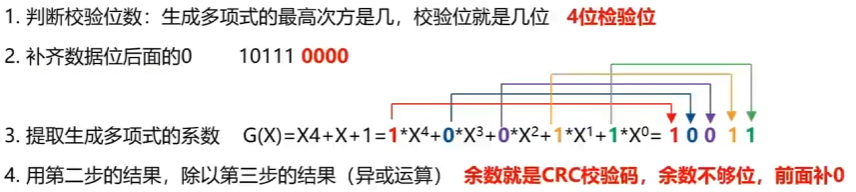

例题：
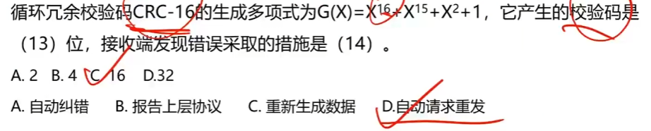

**CRC编码思想**

在m位信息码之后拼接r位校验码。应用CRC码的关键是如何从m位信息位简便地得到r位校验位(编码)，以及如何从 m+r 位信息码**判断是否出错**。

任何一个由二进制数位串成的代码，都可以唯一与一个只含有0和1两个系数的多项式建立一一对应的关系。例如1011011可以看成是一元多项式$x^6$+$x^4$+$x^3$+x+1的系数

在使用CRC编码时，发送方和接收方事先约定一个生成多项式G(x)，这个多项式**最高位和最低位必须是1**。

## 2.8 检错重发ARQ

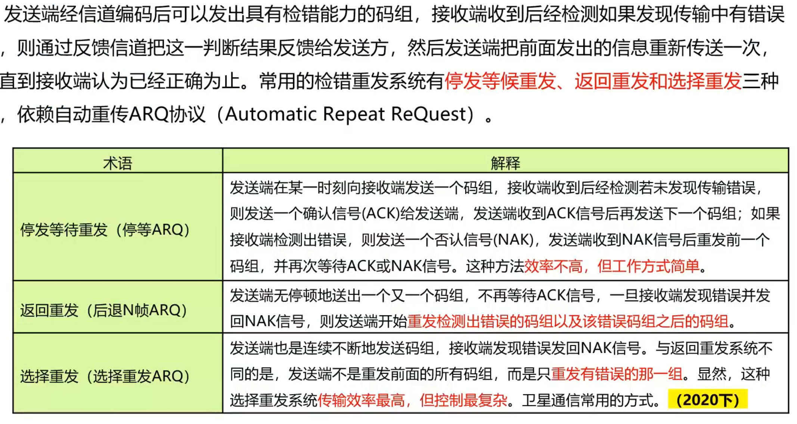

## 2.9 传输介质

双绞线：8根铜导线每2根扭在一起（百兆用4根，干兆必须用8根）

分类：直通线/交叉线，屏蔽和非屏蔽双绞线

光纤：利用光在**玻璃或塑料纤维**中的**全反射原理**而达成的光传导工具

- 光传导损耗比电缆传导的损耗低得多，光纤适合用于长距离的信息传
- 光纤特点：重量轻，体积小、传输远(衰减小)、容量大、抗电磁干扰

**单模光纤**

- 当光纤的几何尺寸可以于光波长相比拟时，即纤芯的几何尺寸与光信号波长相差不大时，一般为5~10μm
- 光纤只允许**一种模式在其中传播**，单模光纤具有极宽的带宽，特别适用于**大容量、长距离的光纤通信**(贵)

**多模光纤**

- 多模光纤纤芯的几何尺寸远大于光波波长，一般为50μm、62.5μm；允许**多种模式光信号传播**;
- 多模光纤仅用于**较小容量、短距离的光纤传输通信**(便宜，胖子不值钱)

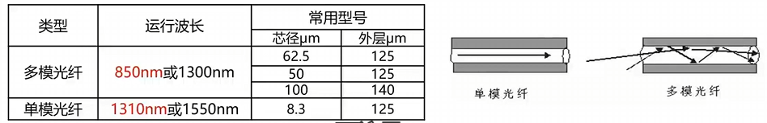

多模与单模对比

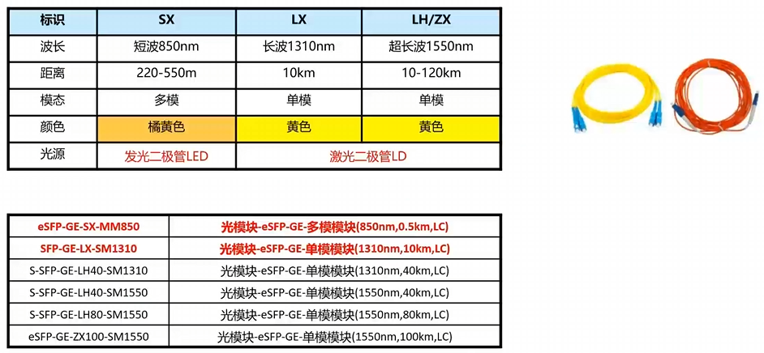

## 3 基础网络协议

## 3.1 IP地址基础

在IP网络中，通信节点需要有一个唯一的IP地址;

IP地址用于IP报文的寻址以及标识一个节点;

IPv4地址一共32bits，使用点分十进制的形式表示;

IPv6地址一共128位，用冒号分割的16进制表示。

### 3.1.1 IP地址类型

子网内的**地址角色**（微观/实际使用）:

网络地址:指代网络的地址。在网络的IPv4地址范围内，最小地址保留为网络地址。此地址的主机部分的每个主机位均为0（即 `192.168.1.0`）。代表这个网络本身，不能分配给具体设备。

广播地址:用于向网络中的所有主机发送数据的特殊地址。广播地址使用该网络范围内的最大地址。即主机部分的各比特位全部为1的地址（即 `192.168.1.255`）。用于向该网络内的所有设备发送数据，不能分配给具体设备。

主机地址:可分配给网络中终端设备的地址（即 `192.168.1.1` 到 `192.168.1.254`）。

IP地址的**地址类别**（宏观/早期定义）：

### 3.1.2 网络掩码

网络掩码与IP地址搭配使用，用于描述一个IP地址中的网络部分及主机部分。

网络掩码32bits，与32bits的IP地址一一对应，掩码中为1的位对应IP地址中的网络位，掩码中为0的位对应IP地址中的主机位。

### 3.1.3 IP网络通信类型

- 单播Unicast
- 广播 Broadcast
- 组播Multicast

## 3.2 子网划分VLSM

为什么要划分？：一个B类地址用于一个广播域，地址浪费。广播域太庞大，一旦发生广播，内网不堪重负。

如何解决？：将一个网络号划分成多个子网，每个子网分配给一个独立的广播域，如此一来广播域的规模更小、网络规划更加合理，IP地址得到了合理利用。

如何具体划分？：网络位向主机借位，形成子网

可变长子网掩码，VLSM(Variable Length Subnet Mask)

$2^m$  =   向主机位借位后产生的子网个数，m为所借的位数

$2^n-2$   =   向主机位借位后产生的每个子网中可用主机IP数，n为原主机位剔除被借位后的剩余位数，-2的原因是，每个子网中的网络号及广播号不可用

网络划分：

## 3.3 无类域间路由CIDR

CIDR（无类域间路由，超网 Classless Inter-Domain Routing）

1. 减少骨干路由器表项压力
2. 缓解IP地址耗尽

工作原理如下:（路由聚合)

RouterB路由表可以是200.200.192.0/22，而不是象RouterA那样显示4条路由。

例题

## 3.4 IPv6与过渡技术

IPv6地址扩展到128位

采用冒号分隔的十六进制数表示

例：8000:0000:0000:0000:0123:4567:89AB:CDEF

- 每个字段前面的0可以省去，例如0123可以简写为123

- 一个或多个全0字段，可以用一对冒号"::”代替

- 以上地址可简写为 8000::123:4567:89AB:CDEF

- IPv4兼容地址可以写为::192.168.10.1

- 有效0位不可以简写，双冒号只能出现一次

合法写法：
12AB:0000:0000:CD30:0000:0000:0000:0000/60
12AB::CD30:0:0:0:0/60
12AB:0:0:CD30::/60

非法写法：
12AB:0:0:CD3/60(在16位的字段中可以省掉前面的0，但不能省掉后面的0)
12AB::CD30/60(这种表示可展开为12AB:0000:0000:0000:0000:0000:0000:CD30)
12AB::CD3/60(这种表示可展开为12AB:0000:0000:0000:0000:0000:0000:0CD3)

节点地址与其子网前缀组合起来可采用紧缩形式表示，例如节点地址:
12AB:0:0:CD30: 123:4567:89AB:CDEF

若其子网号为2AB:0:0:CD30::/60,则等价的写法是
12AB:0:0:CD30: 123:4567:89AB:CDEF/60

**IPv6地址分类**：

**单播地址**
	不确定地址:地址0:0:0:0:0:0:0:0称为不确定地址，不能分配给任何节点
	回环地址:地址0:0:0:0:0:0:0:1称为回环地址
	可聚合全球单播地址：这种地址在全球范围内有效，相当千IPv4公用地址(前缀为001)
	站点本地地址:相当干IPv4中的私网地址(前缀为1111111011)
	链路本地地址:用于同一链路的相邻节点间的通信(前缀为1111111010) 结合MAC地址自动	生成
	【助记:1聚2恋3占】

**任意播地址** 表示一组接口的标识符，通常是路由距离最近的接口
	任意播地址不能用作源地址，而只能作为目标地址
	任意播地址不能指定给IPv6主机，只能指定给IPv6路由器

**组播地址**
	发往组播地址的分组被传送给该地址标识的所有接口
	IPv6中没有广播地址，它的功能已被组播地址所代替
	IPv6组播地址的格式前缀为1111 1111

**IPv4和IPv6地址对比**：

 

**IPv4到IPv6过渡技术**：

**隧道技术**：解决IPv6节点之间通过IPv4网络进行通信
**双栈技术**：同时运行IPv4和IPv6 
**翻译技术**：解决纯IPv6节点与纯IPv4节点之间通进行通信

## 3.5 IP报文格式

IPv4报文格式：

> TTL和协议号考得多
>
> 除了最后一个分片，**每个分片的数据部分必须是8字节的整数倍**（因为偏移量以8为单位）。
>
> 标准头部长度 = **20字节**（IHL=5）

IPv6报文格式：

以太网报文封装：

> 默认**以太网MTU=1500字节**
> **MTU** 是 **Maximum Transmission Unit**（最大传输单元）的缩写

例题：

> 片偏移 = 前面所有分片数据总长 ÷ 8
>
> 总长去头算数据， MTU 减头定每片。
> 除八取整算偏移， 前片累加做分子。
> 非末 MF 等于 1， 最后一片 MF 0。

## 3.6 ICMP

Internet控制消息协议ICMP(Internet Control Message Protocol)是IP协议的辅助协议；协议号为1（仅限IPv4）；排故障用得最多的协议。

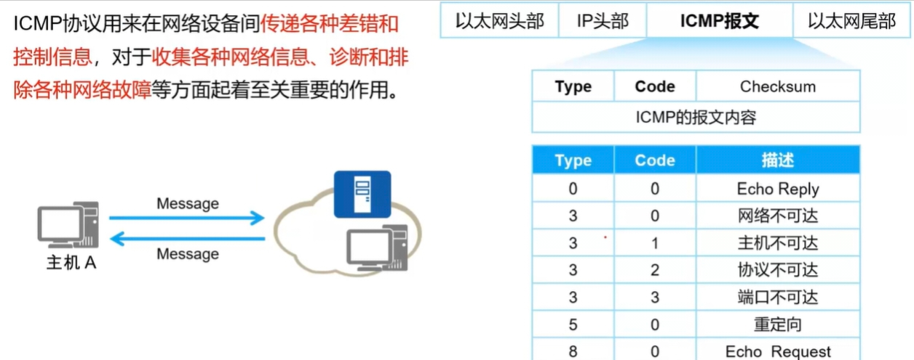

**查询/诊断报文**：Echo Request、Echo Reply，供`ping`使用

**差错报告报文**：目的不可达、时间超过、参数问题、重定向等

ICMP只能反馈部分问题，不能保证IP可靠传输

`ping`的考试范围

- 使用ICMP Echo Request/Reply，即Type 8/0
- 没有TCP/UDP端口号
- 能观察连通性、往返时间RTT、丢包、TTL
- `ping`不通不一定表示IP不通，可能只是ACL或防火墙禁止ICMP
- `ping`通只说明ICMP层面可达，不说明HTTP、数据库等应用服务正常
- Windows常见参数：`-t、-a、-l、-f、-i`

参数不必全部死背，但`-f`禁止分片、`-l`数据长度和MTU问题值得掌握。

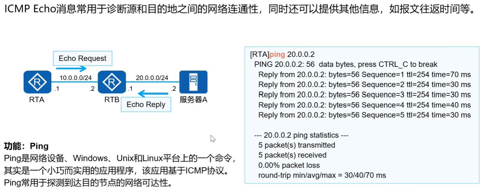

`tracert/traceroute`原理

- Windows `tracert`：通常发送ICMP Echo Request
   中间路由器返回Type 11；目标主机返回Echo Reply。
- Unix/Linux经典`traceroute`：通常发送高端口UDP报文
   中间路由器返回Type 11；到达目的主机后返回Type 3 Code 3端口不可达。

显示`*`只表示在等待时间内没有收到对应响应，不一定表示该跳路由器或链路故障。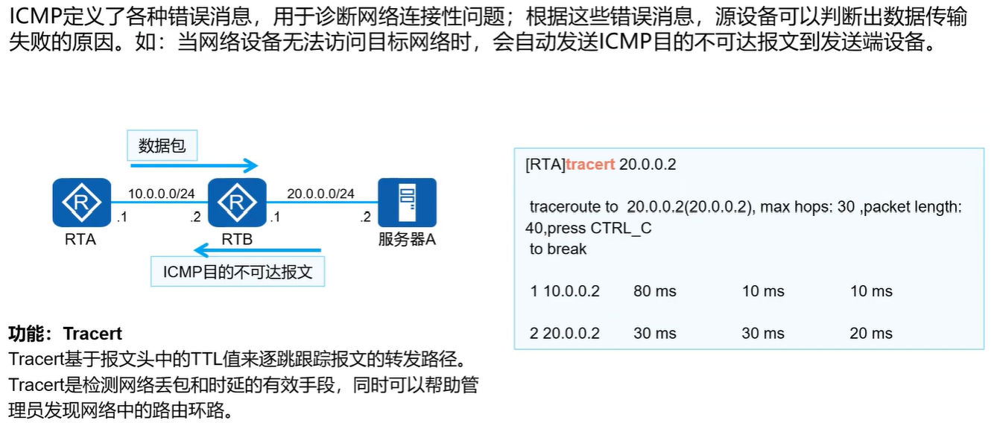

| Type   | Code  | 含义                | 典型场景                   |
| ------ | ----- | ------------------- | -------------------------- |
| 0      | 0     | Echo Reply          | `ping`应答                 |
| 3      | 0     | 网络不可达          | 无到目标网络的路由         |
| 3      | 1     | 主机不可达          | 目标主机不可达             |
| 3      | 2     | 协议不可达          | 目标协议不支持             |
| 3      | 3     | 端口不可达          | UDP目标端口无进程监听      |
| 3      | 4     | 需要分片但DF=1      | IPv4路径MTU发现            |
| 5      | —     | 重定向              | 告知主机存在更合适的下一跳 |
| **8**  | **0** | **Echo Request**    | **`ping`请求**             |
| **11** | **0** | **TTL传输途中超时** | **`tracert/traceroute`**   |
| 11     | 1     | 分片重组超时        | 分片缺失                   |
| 12     | —     | 参数问题            | IP首部字段无法正确处理     |

## 3.7 ARP和RARP

ARP (Address Resolution Protocol）即地址解析协议：用于**解析IPv4地址与链路层MAC地址的对应关系**，仅作用于**本地链路**，直接封装在**以太网帧**中，不封装在IP数据报中。

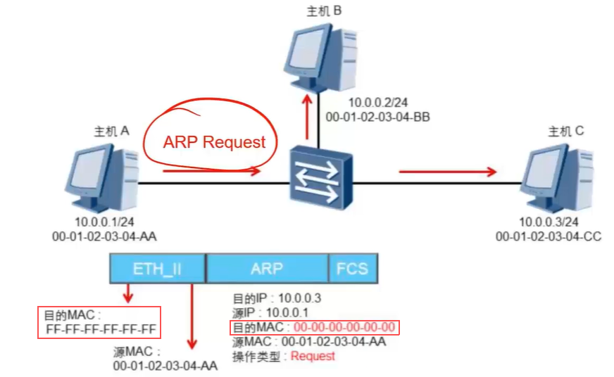

如果IP地址不匹配（主机B），该主机将不会响应该ARP Request报文。

如果匹配：1.该主机会将ARP报文中的源MAC地址和源IP地址信息记**录到自己的ARP缓存表中**；2.**通过ARP Reply报文进行响应**。

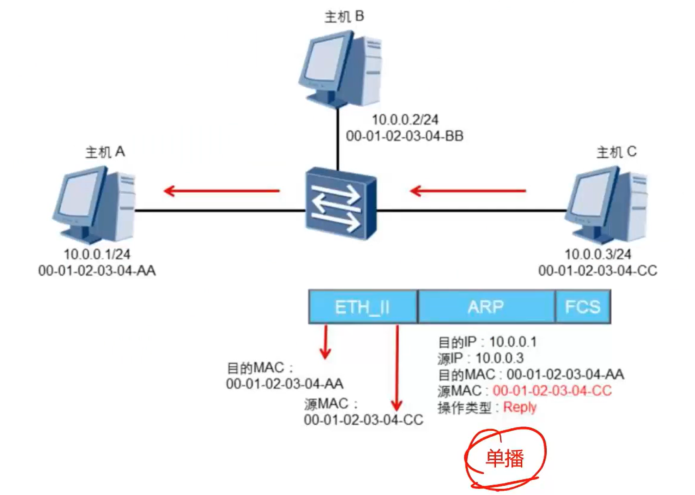

ARP（Address Resolution Protocol,地址解析协议）作用：**根据IP地址查询MAC地址**；
查看ARP缓存表：开始-运行-cmd，arp-a回车，删除ARP缓存arp-d，静态绑定arp-s；
RARP（Reverse Address Resolution Protocol，反向地址转换协议）作用是：**根据MAC地址查找IP地址，常用于无盘工作站**，设备没有硬盘，无法记录IP，刚启动时发送一个广播，用MAC去获取IP。需要一台RARP服务器，根据MAC地址查询服务器IP地址。

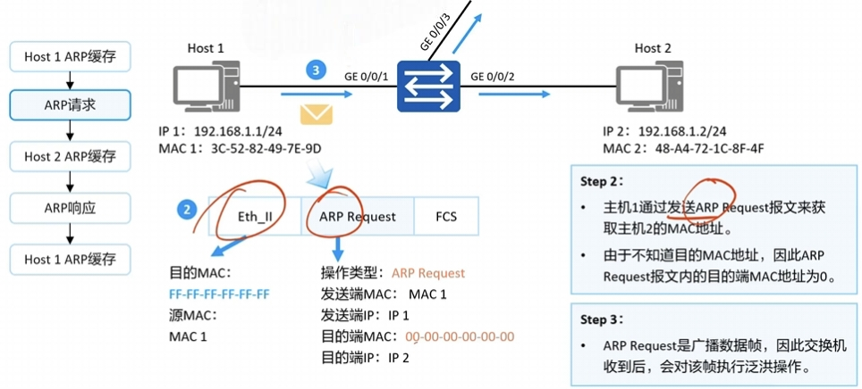

**ARP协议工作流程**：

1.查询ARP缓存。
2.命中则直接使用对应MAC。
3.未命中则发送ARP Request。
4.Request目的MAC为`FF-FF-FF-FF-FF-FF`，在广播域内传播。
5.目标主机识别目标IP是自己，学习请求方的IP–MAC映射。
6.正常ARP Reply使用单播返回。
7.请求方把结果写入ARP缓存，然后封装原来的IP数据报。

## 3.8 TCP和UDP

TCP（传输控制协议）属于**可靠**面向**连接**的网络协议。流控及窗口机制；实用TCP的应用：WEB浏览器、电子邮件、文件传输程序

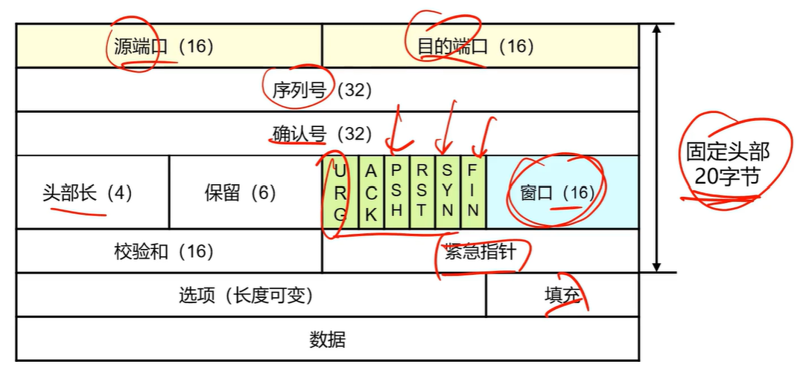

UDP（用户数据报协议）属于**不可靠**面向**无连接**的网络协议。尽力而为的传输；适用UDP的应用：域名系统(DNS)、视频应用、IP语音(VolP)

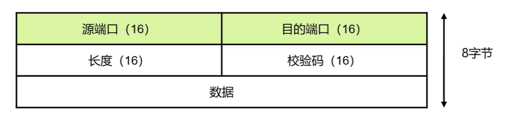

 TCP序列号及确认号：PC1 <-> PC2 目的端口与源端口不变，PC1发seq 10到PC2变为seq 1，ack 11，传回变seq 11，传去变seq 2，ack12。PC2：ack=前seq+1，PC1：seq=ack

三次握手建立连接：

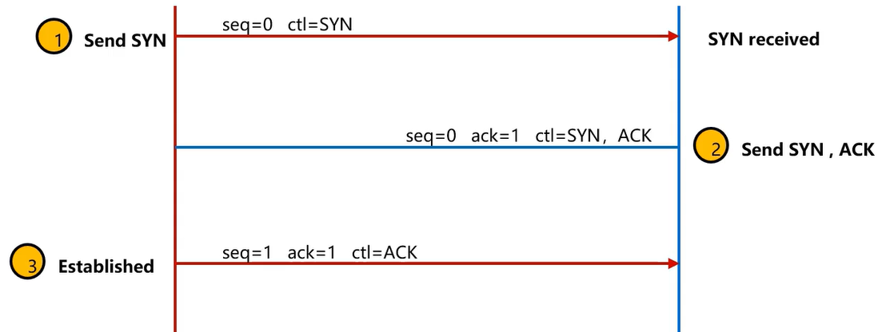

四次握手断开连接：

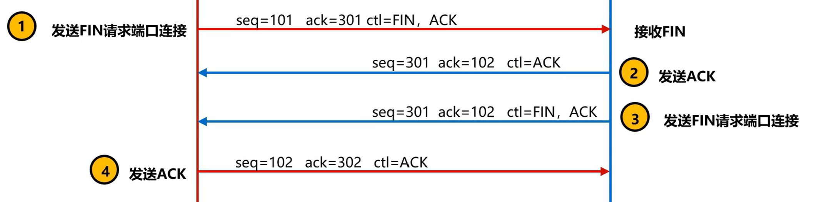

TCP窗口机制

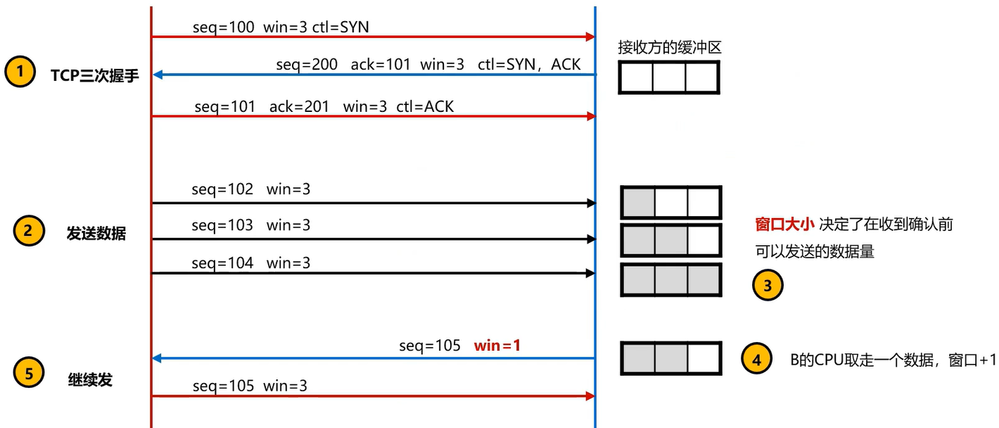

## 3.9 数据封装转发全过程

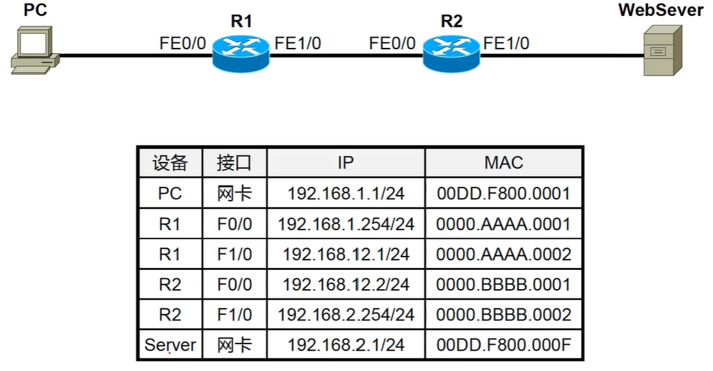

传输过程：

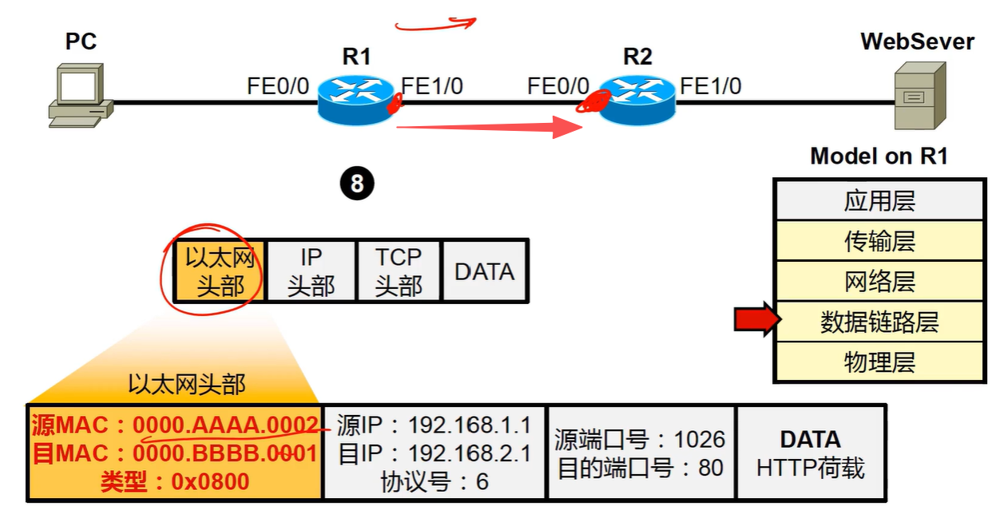

MAC地址都是下一个节点（一跳的目标）而不是最终目的地，IP和TCP是终点
